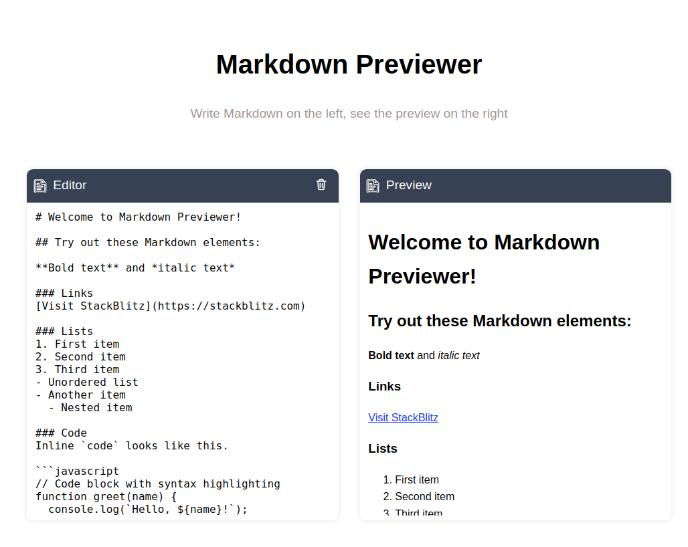
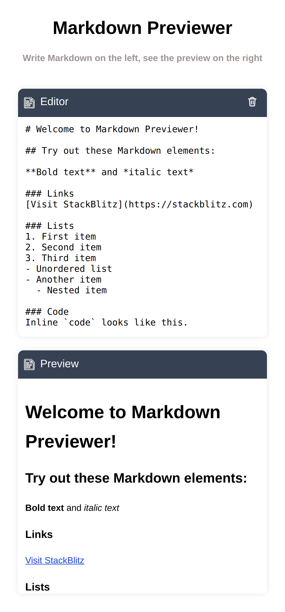

# Markdown Previewer:

A simple web application that allows you to write markdown text and generates preview for that!

## Features:

- **Write Markdown**: Write Markdown text.
- **Preview Markdown**: Preview Markdown text.

## Screenshots:

### Web-Page:

### Mobile-Page:

## Deployment Link:

You can access the live version of the app here:  
[Markdown Previewer](https://marrkdown-previewer.netlify.app/)

## Technologies Used:

- HTML, CSS, and JavaScript for the front-end
- Marked Package for markdown preview generation.
- Highlight.js Package for code highlighting.
